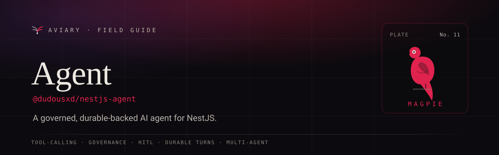

<p align="center">
  <a href="https://davidecarvalho.github.io/aviary/docs/agent">
    
  </a>
</p>

<p align="center">
  <b><a href="https://davidecarvalho.github.io/aviary/docs/agent">📖 Read the documentation</a></b>
  &nbsp;·&nbsp; part of the <a href="https://davidecarvalho.github.io/aviary/"><b>Aviary</b></a> ecosystem for NestJS
</p>

---

# `@dudousxd/nestjs-agent`

[](https://github.com/DavideCarvalho/nestjs-agent/actions/workflows/ci.yml)
[](https://www.npmjs.com/package/@dudousxd/nestjs-agent)
[](https://www.npmjs.com/package/@dudousxd/nestjs-agent)
[](https://github.com/DavideCarvalho/nestjs-agent/blob/master/LICENSE)
[](https://www.typescriptlang.org/)
[](https://nestjs.com/)

A **governed, durable-backed AI agent** for NestJS — the Laravel feel for building an in-app AI
assistant. Chat + tool-calling + role/persona governance + token quota + cost tracking +
human-in-the-loop approval + resumable streaming + **multi-agent delegation**, out of the box.

The agent turn runs as a **durable workflow** (replay-safe, resumable, HITL via signals) — or
in-process when you don't need durability. The **mechanism** is the library; your **domain**
(which tables, which tenant column, which roles/abilities) is policy you supply.

Extracted and generalized from the flip-nestjs admin assistant.

## Packages

| Package | What it is |
|---|---|
| `@dudousxd/nestjs-agent-core` | Framework-agnostic SPIs, tool registry, the agent loop, personas, and the `aviary:agent:*` diagnostics channel |
| `@dudousxd/nestjs-agent` | The NestJS module: `@AiTool` + discovery, `/agent/*` SSE controllers, inline + durable runners, multi-agent `forFeature` |
| `@dudousxd/nestjs-agent-store-mikro-orm` | MikroORM persistence (threads, messages, tool calls, usage, pricing) |
| `@dudousxd/nestjs-agent-store-drizzle` | Drizzle persistence — the same `AgentStore` on a second ORM (SQLite/Postgres) |
| `@dudousxd/nestjs-agent-authz` | Plug `@dudousxd/nestjs-authz` into tool authorization (a tool's `ability` → a `Gate` check) |
| `@dudousxd/nestjs-agent-data` | Governed read-only SQL tool (single-SELECT AST validation, fail-closed table access, tenant scoping) |
| `@dudousxd/nestjs-agent-react` | `useAgentChat` + `AgentChatTransport` (Vercel AI SDK v6) + styling-agnostic chat components; optional `/markdown` subpath |
| `@dudousxd/nestjs-agent-codegen` | A `@dudousxd/nestjs-codegen` extension emitting the `/agent` REST routes into your typed client |
| `@dudousxd/nestjs-agent-telescope` | An "Agent" dashboard tab for `@dudousxd/nestjs-telescope` |
| `@dudousxd/nestjs-agent-dashboard` | A standalone, mountable AI-gateway governance console (bundled React SPA + NestJS module) — no Telescope required |
| `@dudousxd/nestjs-agent-testing` | In-memory store/sink + a deterministic fake model for offline tests/demos |

## Install

```bash
pnpm add @dudousxd/nestjs-agent @dudousxd/nestjs-agent-core
# persistence + (optional) durable runner:
pnpm add @dudousxd/nestjs-agent-store-mikro-orm @dudousxd/nestjs-durable
```

## Quickstart

Register the module, then declare tools as ordinary injectables with `@AiTool`.

```ts
import { AgentModule, HeaderActorResolver } from '@dudousxd/nestjs-agent';

@Module({
  imports: [
    AgentModule.forRoot({
      // --- infrastructure ---
      model: myModelProvider,          // a Vercel AI SDK wrapper (ModelProvider SPI)
      store: myAgentStore,             // e.g. the MikroORM store
      defaultRoles: ['ADMIN'],         // roles a tool requires when its own `roles` is omitted
      actorResolver: new HeaderActorResolver(), // who's calling — see "Identity" below
      // path: 'agent',                // route prefix (default 'agent')
      // durable: true,                // run each turn as the durable `agent.run` workflow
      // --- the default agent (optional) ---
      defaultAgent: {
        systemPrompt: 'You are a helpful ops assistant.',
        // modelId: 'claude-sonnet-4-6', // optional accounting label; the provider can report its own
      },
    }),
  ],
  providers: [GetWeatherTool, PurgeCacheTool],
})
export class AppModule {}
```

```ts
import { AiTool, type ToolHandler, type AiToolCtx } from '@dudousxd/nestjs-agent';
import { z } from 'zod';

@AiTool({
  name: 'getWeather',
  kind: 'read',                        // 'read' auto-executes; 'action' requires HITL approval
  description: 'Current weather for a city.',
  input: z.object({ city: z.string() }),
})
export class GetWeatherTool implements ToolHandler<{ city: string }> {
  async execute(input: { city: string }, ctx: AiToolCtx) {
    return { tempC: 21, summary: 'partly cloudy' };
  }
}
```

The module mounts SSE + REST endpoints under `/agent` (configurable via `path`):

| Method & path | Purpose |
|---|---|
| `POST /agent/chat` | Start a turn; streams tokens as SSE (`event: meta` → `data:{delta}` → `event: done`) |
| `GET /agent/chat/:runId/stream` | Resume an in-flight run's stream |
| `POST /agent/chat/:runId/cancel` | Cancel a run |
| `POST /agent/tool-call/approve` · `/reject` | Human-in-the-loop decision for an `action` tool |
| `GET /agent/threads` · `/:id` · `DELETE /:id` · `POST /:id/fork-from/:messageId` | Thread history |
| `GET /agent/threads/personas/catalog` · `GET /agent/quota/today` | Personas & quota |

### Identity (`ActorResolver`)

The agent never invents a caller. Every request's actor — `{ id, roles?, tenantRef? }` — comes
from an `ActorResolver` you configure; tool authorization is a set-intersection of the actor's
`roles` against each tool's. There's **no insecure default**: omit `actorResolver` and every request
throws until you wire one. The shipped `HeaderActorResolver` reads `x-actor-id` /
`x-actor-role` (comma-separated → `roles`) / `x-tenant-ref` and is only safe behind a trusted gateway
that strips and re-sets those headers; production apps typically implement `ActorResolver` over a
verified session/JWT instead.

### Human-in-the-loop & durability

A `kind: 'action'` tool never auto-executes — the loop pauses for an approve/reject decision.
With `durable: true` (plus `AgentDurableModule` and a configured `DurableModule`), that pause is a
real durable suspend: the run is checkpointed to the state store on `ctx.waitForSignal` and resumes
on approval — surviving restarts, replay-safe. Without durable, an in-process runner holds the turn
open. Either way the wire protocol is identical.

## Multi-agent (orchestrator → sub-agents)

Register named agents with `forFeature`; declare which agents an orchestrator may call via
`delegatesTo`. The library synthesizes an `ask_<name>` tool for each edge; when the model calls it,
the loop runs the sub-agent — a **durable child run** under `durable: true`, a nested in-process
loop otherwise. Each delegation is also an `aviary:agent:delegated` event.

```ts
AgentModule.forFeature([
  {
    name: 'ops-orchestrator',
    systemPrompt: 'You coordinate specialists. Delegate weather questions to weather-analyst.',
    delegatesTo: ['weather-analyst'],
  },
  { name: 'weather-analyst', systemPrompt: 'You answer weather questions.', tools: ['getWeather'] },
]);
```

Target an agent per request with `{ "agent": "ops-orchestrator" }` in the chat body. Each agent
gets its own system prompt, model, and tool allow-list (intersected with the persona's).

## Authorization

A tool declares **one** of two gates — `roles` or `ability`:

- **`roles`** (built-in policy): `@AiTool({ roles: ['ADMIN'] })` — the actor passes if any of its
  `roles` intersects the tool's. Omit `roles` and the tool falls back to the module's `defaultRoles`.
- **`ability`** (delegated to an ability-aware policy): `@AiTool({ ability: 'cache.purge' })` — checked
  by [`@dudousxd/nestjs-authz`](https://github.com/DavideCarvalho/aviary) via
  `gate.forUser(actor).allows(ability)` once you add `AgentAuthzModule`. Tools without an `ability`
  fall back to the role policy, so non-authz apps are unaffected.

```ts
@Module({ imports: [AuthzModule.forRoot(/* … */), AgentAuthzModule.forRoot()] })
export class AppModule {}

@AiTool({ name: 'purgeCache', kind: 'action', description: '…', input: z.object({ key: z.string() }),
          ability: 'cache.purge' })
export class PurgeCacheTool implements ToolHandler<{ key: string }> { /* … */ }
```

## Governed SQL (`-data`)

Give the model read-only SQL access without handing it the database. Every query is AST-validated
(single SELECT only), checked against a fail-closed table-access policy, optionally rewritten to
scope it to the caller's tenant, and capped with a LIMIT — before your injected runner touches the
DB.

```ts
import { createExecuteSqlTool, GroupTableAccessPolicy, TenantScopeRewriter } from '@dudousxd/nestjs-agent-data';

// returns a { spec, handler } pair — register it with the tool registry at bootstrap
const { spec, handler } = createExecuteSqlTool({
  runner: { run: (sql) => readOnlyPool.query(sql) },           // you supply the pool
  tableAccess: new GroupTableAccessPolicy({ roleGroups, tablesByGroup }),
  tenantScope: new TenantScopeRewriter({ tenantColumn: 'tenant_id', scopedTables: ['orders'] }),
});
```

## Frontend (`-react`)

`useAgentChat` wraps the Vercel AI SDK v6 `useChat` with a transport for the `/agent/chat` SSE,
plus threads, personas, quota, cancel, and HITL approve/reject. The components are styling-agnostic
(every action is a callback, all styling via `classNames`). The optional
`@dudousxd/nestjs-agent-react/markdown` subpath ships a full streamdown renderer (GFM, KaTeX,
syntax-highlighted code, Mermaid) you can drop into the `renderText` slot.

```tsx
// baseUrl is the origin (default '' = same origin); the transport appends '/agent/chat' itself
const chat = useAgentChat({ getHeaders: () => ({ 'x-actor-id': me.id, 'x-actor-role': me.roles.join(',') }) });
```

## Observability (diagnostics)

The agent emits `aviary:agent:*` events (`run.started`, `message`, `tool-call`, `delegated`,
`quota.exceeded`, `run.finished`) on Node's `diagnostics_channel`. `@dudousxd/nestjs-agent-telescope`
consumes them for a dashboard tab; any app can subscribe for its own metrics, alerts, or an
orchestration graph — the library instruments nothing in your code.

## Cost & governance

Every turn writes a usage-ledger row (`agent_token_usage`); the read-model
(`AgentGovernanceQueries`) rolls those up into spend per model, per actor, a usage trend, and recent
tool-call / thread activity. Cost is resolved **per row**:

```text
costUsd = COALESCE(reportedCostUsd, cache-aware token estimate)
```

- **Provider-reported cost wins.** A gateway that knows the real spend of a turn — Vercel AI Gateway
  (`providerMetadata.gateway.cost`), OpenRouter (`total_cost`) — reports it via `ModelTurnResult.costUsd`;
  the loop persists it to the nullable `cost_usd` column and the read-model uses it verbatim. Direct
  providers (Anthropic/OpenAI/Bedrock) report only tokens and fall through to the estimate.
- **The fallback estimate is cache-aware.** `MessageUsage` carries `cacheWriteTokens` / `cacheReadTokens`
  (subsets of `inputTokens`) and `reasoningTokens` (a subset of `outputTokens`, observability only).
  `AgentModelPricing` has nullable `cacheWritePricePer1m` / `cacheReadPricePer1m` rates: the uncached
  remainder is priced at the input rate, cache-write/read at their own rates (falling back to the input
  rate when unset). Because the cache counts are subsets, token totals and quota never change — a pricing
  table with no cache data reduces exactly to `input×inputPrice + output×outputPrice`.

Surface it either way: **`@dudousxd/nestjs-agent-telescope`** adds governance sections to a Telescope
install, or **`@dudousxd/nestjs-agent-dashboard`** mounts a standalone console (a bundled React SPA
served by a NestJS module) at its own route with no Telescope dependency:

```ts
import { AgentDashboardModule } from '@dudousxd/nestjs-agent-dashboard';

@Module({ imports: [AgentDashboardModule.forRoot({ basePath: '/ai-gateway' })] })
export class AppModule {}
```

Both read the same `AGENT_GOVERNANCE_QUERIES` read-model (bound by the store modules) and tail live
tool-call / quota signals off the `aviary:agent:*` diagnostics channel.

## Example

`examples/agent-demo` is a runnable, fully-offline proof (`pnpm --filter agent-demo demo`): a read
tool auto-executing, an action tool suspending on a durable HITL signal and resuming on approval, and
an orchestrator delegating to a sub-agent — all with the in-memory store + a deterministic fake model,
no API key or Redis. `pnpm --filter agent-demo start` boots the full NestJS app with the governance
console mounted at `/ai-gateway`. See `docs/superpowers/specs/` for the API and governance-console
design specs.

## Status

Early development (`0.x`). The package surface and SPIs are stabilizing.

## License

MIT © Davide Carvalho
